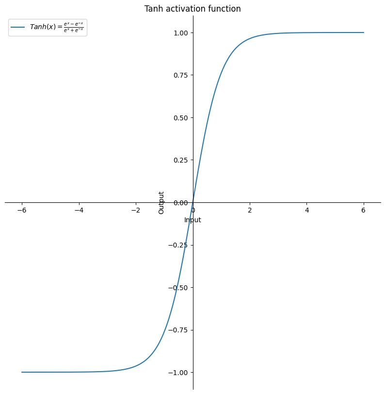
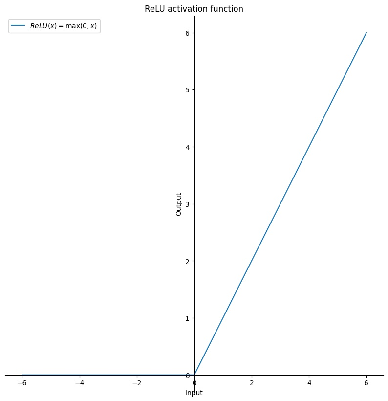

# Sigmoid
=&space;\frac{1}{1&plus;e^{-x}}&space;)

# Tanh
&space;=&space;\frac{e^{x}&space;-&space;e^{-x}}&space;{e^{x}&space;&plus;&space;e^{-x}})

# ReLU
&space;=&space;\max(0,&space;x))

# LeakyReLU
&space;=&space;\max(0.01x,&space;x))
